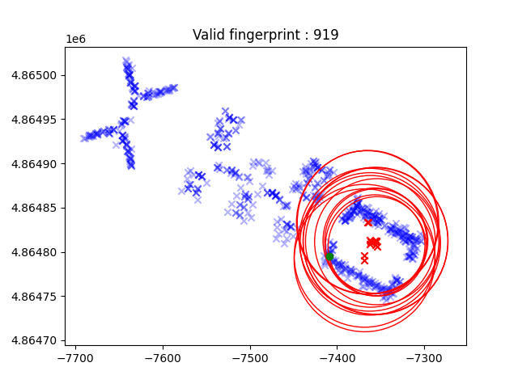
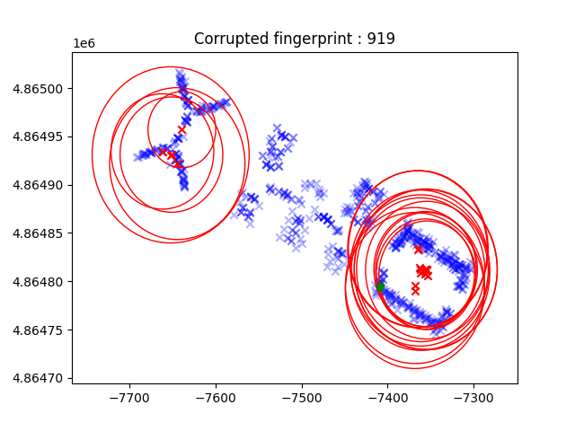

# Algorythmes Description

In this section, I will describe the three KNN algorithms that I used in this project.

# KNN - Shared Coordinates

**Input Parameters:**

- `k`: Number of neighbors to consider.
- `trning_r_m` : Training Radio Map (the list of all the training fingerprints).
- `trgt_fgpt` : Target fingerprint (the fingerprint sent by the user).
- `limit` : A threshold to determine the minimum allowable difference in RSS measurements between the target and training fingerprints.

**Data Preparation:**

- `trning_rss_matrix`: The RSS matrix from the training radio map (each row represents a training fingerprint RSS vector).
- `trning_pos_matrix` : The position matrix from the training radio map (each row represents a training fingerprint position vector in 3D space).
- `trgt_rss` : The RSS vector from the target fingerprint.

**Identify Shared Coordinates:**

- As we know, each fingerprint is composed of a set of RSS measurements. Sometimes, some measurements can be missing due to the fact that the Access Point is unreachable. To effectively compare the target fingerprint with the training fingerprints, we need to compare only the training fingerprints that have, within a certain limit, the same RSS measurements as the target fingerprint.

- `shared_coord` : To do so, we calculate the _Shared Coordinates_ between each training fingerprint and the target fingerprint. This is done by comparing RSS values to a "no data" value of 100. The goal is to find fingerprints where the difference in RSS measurements is within the specified limit.

- `filtered_trning_rss_matrix` : We filter the training RSS matrix to keep only the fingerprints that have a correct number of shared coordinates, according to the limit.

**Calculate Squared Differences:**

- `filtered_diff_sq` : We calculate the squared differences between the target fingerprint and the filtered training fingerprints.

_**Note:** When a coordinate is missing in one fingerprint compared to the other, we don't take this distance into account (meaning that we add 0 to the sum)._

**Calculate Distances:**

- `distances` : We calculate the Euclidean distance between the target fingerprint and the filtered training fingerprints, based on the previous squared differences.

**Check Neighbor Count:**

- If the number of distances calculated is less than `n_neighbors`, it means there are not enough nearby neighbors to estimate the position accurately. In this case, return [0, 0, 0] to indicate that the position estimate is not possible.

**Sort Distances:**

- Sort the distances in ascending order to find the closest neighbors.

**Calculate Average Position:**

- We calculate the average position of the closest neighbors and return it as the estimated position of the target fingerprint.

## Pseudo Code

```
FUNCTION find_position_SC_method(k, trning_r_m, trgt_fgpt, limit):


    ; Data Preparation

    trning_rss_matrix   ; Extract RSS matrix from the training radio map
    trning_pos_matrix   ; Extract position matrix from the training radio map
    target_rss          ; Extract RSS vector from the target fingerprint


    ; Identify Shared Coordinates AND Calculate Squared Differences

    match_coord_matrix <- SUM OF TRUE WHEN (target_rss != 100) AND (trning_rss_matrix != 100)
    filtered_trning_rss_matrix <- trning_rss_matrix WHERE (match_coord_matrix >= limit)
    filtered_diff_sq <- SQUARE (target_rss - filtered_trning_rss_matrix)

    filtered_trning_pos_matrix <- trning_pos_matrix WHERE (match_coord >= limit)


    ; Adjust Squared Differences

    FOR EACH diff-sq IN filtered_diff_sq :
        IF target_rss == 100 AND trning_rss_matrix[AT diff-sq INDEX] != 100 OR target_rss != 100 AND trning_rss_matrix[AT diff-sq INDEX] == 100 :
            diff <- 0
    END FOR


    ; Calculate Distances

    distances <- SQRT(SUM(filtered_diff_sq))


    ; Check Neighbors Count

    IF LENGHT(distances) < k:
        RETURN (0,0,0)
    END IF


    ; Sort Distances

    sorted_indexes <- SORTED VALUE INDEXES (distances)
    closest_neighbors_indexes <- sorted_indexes[FIRST k VALUES]


    ; Calculate Average Position

    average_position <- MEAN(filtered_trning_pos_matrix[AT closest_neighbors_indexes])


    ; Return Average Position

    RETURN average_position

END FUNCTION
```

# KNN - Unshared Coordinates

This algorithm is similar to the previous one, with the difference that we don't filter the training fingerprints by the number of common coordinates but by the number of values that are present in one fingerprint and not in the other.

The differences between this algorithm and the previous one are as follows:

**Input Parameters:**

- `limit` : A threshold to determine the maximum allowable difference in RSS measurements between the target and training fingerprints.

_Note: The limit is now a maximum instead of a minimum._

**Calculate Squared Differences:**

- `filtered_diff_sq` : We calculate the Squared Differences between the target fingerprint and the filtered training fingerprints.

**Adjust Squared Differences:**

- Now, instead of not taking into account the difference when one fingerprint has a missing value compared to the other, we add a penalty to improve the precision of the algorithm. The penalty is proportional to the number of unshared coordinates (RSS values that are present in only one fingerprint). Specifically, we have chosen to add **13** times the number of unshared coordinates.

## Pseudo Code

```
FUNCTION find_position_SC_method(k, trning_r_m, trgt_fgpt, limit):


    ; Data Preparation

    trning_rss_matrix   ; Extract RSS matrix from the training radio map
    trning_pos_matrix   ; Extract position matrix from the training radio map
    target_rss          ; Extract RSS vector from the target fingerprint


    ; Identify Shared Coordinates AND Calculate Squared Differences

    unmatch_coord_matrix = SUM OF TRUE WHEN ((target_rss == 100) AND (trning_rss_matrix != 100)) OR ((target_rss != 100) AND (trning_rss_matrix == 100))

    filtered_trning_rss_matrix <- trning_rss_matrix WHERE (match_coord_matrix < limit)
    filtered_diff_sq <- SQUARE (target_rss - filtered_trning_rss_matrix)

    filtered_trning_pos_matrix <- trning_pos_matrix WHERE (match_coord < limit)


    ; Adjust Squared Differences

    FOR EACH diff-sq IN filtered_diff_sq :
        IF target_rss == 100 AND trning_rss_matrix[AT diff-sq INDEX] != 100 OR target_rss != 100 AND trning_rss_matrix[AT diff-sq INDEX] == 100 :
            diff <- 13*unmatch_coord[AT diff-sq INDEX]
    END FOR


    ; Calculate Distances

    distances <- SQRT(SUM(filtered_diff_sq))


    ; Check Neighbors Count

    IF LENGHT(distances) < k:
        RETURN (0,0,0)
    END IF


    ; Sort Distances

    sorted_indexes <- SORTED VALUE INDEXES (distances)
    closest_neighbors_indexes <- sorted_indexes[FIRST k VALUES]


    ; Calculate Average Position

    average_position <- MEAN(filtered_trning_pos_matrix[AT closest_neighbors_indexes])


    ; Return Average Position

    RETURN average_position

END FUNCTION
```

# KNN - Variable Threshold (VT)

This algorithm is similar to the previous one, with the key difference being that we don't set a fixed limit to filter the training fingerprints. Instead, we calculate a limit for each fingerprint based on the ratio of shared coordinates to the total valid values.

The differences between this algorithm and the previous one are as follows:

**Input Parameters:**

- `limit_rate` : A threshold to determine the minimum ratio of shared coordinates between the target and training fingerprints.

_Note: The limit is now a ratio instead of a specific number._

**Calculate the limit:**

- `limit` : We calculate the limit for each fingerprint based on the `limit_rate` and the number of valid RSS values in the target fingerprint.

_Note: In this context, we consider an RSS value as "valid" if it is not equal to 100 and is greater than or equal to -85 dBm._

**Adjust Squared Differences:**

- Similar to the Unshared Coordinates (UC) method, we incorporate a penalty when necessary to enhance the accuracy of the algorithm.

## Pseudo Code

```
FUNCTION find_position_SC_method(k, trning_r_m, trgt_fgpt, limit):


    ; Data Preparation

    trning_rss_matrix   ; Extract RSS matrix from the training radio map
    trning_pos_matrix   ; Extract position matrix from the training radio map
    target_rss          ; Extract RSS vector from the target fingerprint


    ; Identify Shared Coordinates AND Calculate Squared Differences

    match_coord_matrix <- SUM OF TRUE WHEN (target_rss != 100) AND (trning_rss_matrix != 100)
    unmatch_coord_matrix = SUM OF TRUE WHEN ((target_rss == 100) AND (trning_rss_matrix != 100)) OR ((target_rss != 100) AND (trning_rss_matrix == 100))

    limit <- limit_rate * SUM OF TRUE WHEN (target_rss != 100) AND (target_rss >= -85)

    filtered_trning_rss_matrix <- trning_rss_matrix WHERE (match_coord_matrix >= limit)
    filtered_diff_sq <- SQUARE (target_rss - filtered_trning_rss_matrix)

    filtered_trning_pos_matrix <- trning_pos_matrix WHERE (match_coord >= limit)


    ; Adjust Squared Differences

    FOR EACH diff-sq IN filtered_diff_sq :
        IF target_rss == 100 AND trning_rss_matrix[AT diff-sq INDEX] != 100 OR target_rss != 100 AND trning_rss_matrix[AT diff-sq INDEX] == 100 :
            diff <- 13*unmatch_coord[AT diff-sq INDEX]
    END FOR


    ; Calculate Distances

    distances <- SQRT(SUM(filtered_diff_sq))


    ; Check Neighbors Count

    IF LENGHT(distances) < k:
        RETURN (0,0,0)
    END IF


    ; Sort Distances

    sorted_indexes <- SORTED VALUE INDEXES (distances)
    closest_neighbors_indexes <- sorted_indexes[FIRST k VALUES]


    ; Calculate Average Position

    average_position <- MEAN(filtered_trning_pos_matrix[AT closest_neighbors_indexes])


    ; Return Average Position

    RETURN average_position

END FUNCTION
```

# KNN - Secure - How to detect an attack

In this section, I will explain a method for detecting spoofing attacks. The aim of such an attack is to send fake beacons as if they were transmitted by Access Points that are not supposed to be in the user's vicinity. This could lead to a less precise determination of the user's position or even force the user to receive a position desired by the attacker.

The primary approach to counter these attacks is to detect them. To achieve this, we can implement a filter for user fingerprints to exclude corrupted ones. The main idea is to examine which Access Points (APs) are detected in the fingerprint, and check for any APs that shouldn't be present together because they are normaly too distant from each other.

First, we need to generate metadata from the training dataset. For each AP in the Training Dataset, we will calculate the average weighted position of the fingerprints and the maximum distances between the fingerprints.

Based on this metadata, we can create a map with circles representing each AP's range. To detect an attack, we check if every AP detected in the user's fingerprint shares a common area on the map. If not, we can consider it as a potential attack.

To enhance this method further, we can set thresholds to allow some circles not to share the same area and give some flexibility to this method.
We can implement two types of thresholds, a global one and a local one.

- The global threshold counts the number of APs that do not share a common area pairwise, and the threshold is set on this count.
- The local threshold counts the number of APs that do not share the same area for each AP. The threshold is set on the count for each AP individually.

## Some informations about the implementation :

- About the metadata generation : I calcul the center position based on the position of the fingerprints that detect this AP. To calculate the average position I have chose to make a weighted average base on the rssi value. The weight are proportinnal to the rssi value. It's not the only way to do since it's really hard to tell estimate global weight calculation of each rssi value since it can depend on reflection, big walls or juste basic attenuation. The weights is calculated as (1.0 / abs(rssi)). However, in the Training dataset there is some rssi value equals to 0dBm. So the actual calcul is (1.0 / (abs(rssi) + 1)).

- I've implemented two different threshold methods, but this algorithm performs better when the tolerance is set to 0. In every simulation, the type of filter used is the Global Filter (GF), but it doesn't impact the results since the tolerance is set to 0. _The adjustment of this threshold could be beneficial if we aim to reduce false positives, but since the detection of attacks is not perfect, I've decided to keep the tolerance at 0. However, the false positive rate is still at 17%, indicating that there is room for improvement._

## Filter Example :

- Each red point represents the center of supposed APs, and each red circle indicates their respective range.
- The green point represents the actual location of the user's fingerprint. These APs are detected by the user, as indicated by RSSI values in the fingerprint that are not equal to 100.
- Each blue point represents fingerprints from the training dataset, helping visualize the buildings and map organization.

The valid fingerprint is from the Validation dataset (at row 919), and there is a corresponding corrupted fingerprint from the Validation_8 scenario 2 dataset.





In this case, with the corrupted fingerprint, it's evident that not all the APs are in the same area, which leads us to consider that there is an attack.
