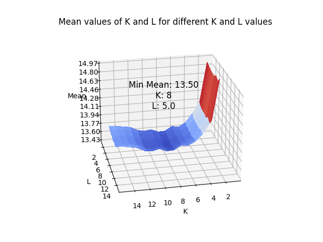

# Results Description

# (K,L) Determination

First, we need to determine the values of K and L that yield the best results for the model. To do this, I test several combinations of K and L values for each algorithm and store the results in the K*L_determination folder. For each algorithm (SC, UC, VT), I test K and L values from a minimum to a maximum value with a preset tolerance on the number of acceptable failures (If you're not familiar with why the positioning can fail, please refer too [the description of the algorythmes](algorythme_description.md)). The results are stored in a CSV file named \*\*K_L_evaluation_using*[...]\_method\__{K_max}_\__{L_max}_\__{tolerance}_.csv\*\*

For each K,L combination, the file contains the following information :

- mean error : the mean error
- std error : the standard deviation of the error of the positioning for the K,L combination
- fail rate : the rate of fail for the K,L combination
- max error : the maximum error
- min error : the minimum error
- median error : the median of the error
- 15th percentile : the 15th percentile of the error
- ...
- 99th percentile : the 99th percentile of the error

_When the fail rate is over the maximum tolerance, values are set to 'x' in the csv file._

## Results

We can then plot some 3D graphs to identify a minimum for the mean error and find the corresponding couple (K, L) that provides the best results.

For the SC algorithm, we obtain the following graph:

For the UC algorithm:

For the VT algorithm:

## Overall Results

We can then evaluate the performance of each algorithm on the Validation dataset.

# Security Results

Now, let's examine the results of these algorithms on corrupted datasets. To do so, we will use scenario 1 and scenario 2 corrupted datasets and assess the performance of the algorithms (SC, UC, VT, and Secure UC).

Each file represents the results of one algorithm over one scenario. In these files, we have:

- Name of the corrupted dataset.
- Number of successful attacks.
- Number of failed attacks.
- Number of positioning failures due to attacks.
- Number of positioning failures under normal conditions.
- Mean error compared to the position normally obtained.
- Mean error compared to the actual position of the fingerprint.
- Total number of attacks.

## Additional Information

We need to define what constitutes a successful attack. I consider an attack successful if the estimated position is not null (i.e., it doesn't fail) and if the estimated position is different from the position normally obtained. The position normally obtained is the position obtained when the fingerprint is not corrupted. In all other circumstances, the attack is considered a failure.

Following that, we have the positioning failures due to attacks, which is the number of failed position estimations with the corrupted fingerprint. The failures under normal conditions represent the number of positioning failures with the normal fingerprint.

**Warning** : The mean errors in these files represent the average of all errors when the **attack is successful.**

## Graphs

We can create graphs to visualize the results of the algorithms against corrupted fingerprints.

